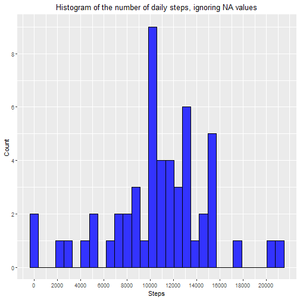

# Introduction

It is now possible to collect a large amount of data about personal movement using activity monitoring devices such as a Fitbit, Nike Fuelband, or Jawbone Up. These type of devices are part of the “quantified self” movement – a group of enthusiasts who take measurements about themselves regularly to improve their health, to find patterns in their behavior, or because they are tech geeks. But these data remain under-utilized both because the raw data are hard to obtain and there is a lack of statistical methods and software for processing and interpreting the data.

This report makes use of data from a personal activity monitoring device. This device collects data at 5 minute intervals through out the day. The data consists of two months of data from an anonymous individual collected during the months of October and November, 2012 and include the number of steps taken in 5 minute intervals each day.

The dataset (52K) can be downloaded from [here](https://d396qusza40orc.cloudfront.net/repdata%2Fdata%2Factivity.zip).

The variables included in the dataset are:

- steps: Number of steps taking in a 5-minute interval (missing values are coded as NA).
- date: The date on which the measurement was taken in YYYY-MM-DD format.
- interval: Identifier for the 5-minute interval in which measurement was taken.

The dataset is stored in a comma-separated-value (.csv) file and there are a total of 17,568 observations in the dataset.

# Statistical Report

With the appropriate data analysis, this report is intended to answer four questions:

- What is mean total number of steps taken per day?
- What is the average daily activity pattern?
- What's different when imputing missing values?
- Are there differences in activity patterns between weekdays and weekends?

## Loading and preprocessing the data

Let's start downloading the data from the link mentioned in the introduction, saving it to folder **data** (in the working directory), and unzipping to file **activity.csv**:


```r
if (!dir.exists("data")){
    dir.create("data")
}
if (!file.exists("./data/activity.csv")) {
    fileUrl <- "https://d396qusza40orc.cloudfront.net/repdata%2Fdata%2Factivity.zip"
    download.file(fileUrl, destfile = "./data/activity.zip", method = "curl")
    unzip(zipfile = "./data/activity.zip", overwrite = TRUE, exdir = "data")
}
```

Now, let's read the file "activity.csv" and create the data frame **df**, that will have the variables **steps**, **date** and **interval**:


```r
df <- read.csv("./data/activity.csv")
```

Finally, let's use the function as.Date() to change the class of date into "Date":


```r
df <- read.csv("./data/activity.csv")
df$date <- as.Date(df$date,"%Y-%m-%d")
```

## What is mean total number of steps taken per day?

To answer this question we're going to ignore the missing values in the dataset. So, let's first subset **df** to create the data frame without "NA" values, **df_wna**:


```r
df_wna <- subset(df, !is.na(steps))
```

Second, let's calculate the total number of steps taken per day, saving this information to the new data frame **daily_steps_df**:


```r
daily_steps <- with(df_wna,tapply(steps, date, sum))
# create a data frame to plot with ggplot
daily_steps_df <- data.frame(steps=daily_steps)
```

Third, let's make a histogram of the total number of steps taken each day:


```r
library(ggplot2)
ggplot(daily_steps_df, aes(x=steps)) +
    geom_histogram(bins=30, color="black", fill="#3333FF") +
    scale_x_continuous(breaks=seq(0,20000,2000)) +
    scale_y_continuous(breaks=seq(0,10,2)) +
    theme(plot.title = element_text(hjust = 0.5)) +
    labs(title="Histogram of the number of daily steps, ignoring NA values") +
    labs(x="Steps", y="Count")
```



Finally, let's calculate the mean and median of the total number of steps taken each day:


```r
daily_mean <- mean(daily_steps_df$steps)
daily_median <- median(daily_steps_df$steps)
```

The mean is 10766 steps and the median is 10765 steps.

## What is the average daily activity pattern?

To answer this question, we're going to make a time series plot of the 5-minute interval (x-axis) and the average number of steps taken, averaged across all days (y-axis), ignoring the missing values in the dataset.

First, let's compute the average number of steps per 5-minute interval using the dataframe **df_wna**, and save this information to the new dataframe **ave_daily_steps_df**, that will contain the variables **steps** and **interval**:


```r
ave_daily_steps <- with(df_wna, tapply(steps, interval, mean))
# create a data frame to plot with ggplot
ave_daily_steps_df <- data.frame(steps=ave_daily_steps, 
                                 interval=as.numeric(dimnames(ave_daily_steps)[[1]]))
```

Since the variable **interval** is not continuous, let's create the variable **continuous_interval** to be plot on the x-axis:


```r
continuous_interval <- 0:(nrow(ave_daily_steps_df)-1)
```

Now, let's prepare the tick mark locations and tick mark labels for the x-axis, such that the graph shows a mark every two hours starting at 0:00 and ending at 24:00:


```r
tickmark_locations <- seq(0,nrow(ave_daily_steps_df),24)
tickmark_labels <- tickmark_locations / 12 * 100
```

Let's plot:


```r
ggplot(data=ave_daily_steps_df, aes(x=continuous_interval, y=steps)) +
    geom_line(color="#3333FF") +
    scale_y_continuous(breaks=seq(0,225,25)) +
    theme(plot.title = element_text(hjust = 0.5)) +
    labs(title="Number of steps taken averaged across all days per 5-minute interval") +
    labs(x="Interval", y="Steps") +
    scale_x_continuous(breaks=tickmark_locations, labels=tickmark_labels)
```


Finally, to know which 5-minute interval, on average across all the days in the dataset, contains the maximum number of steps, we compute:


```r
max_average <- subset(ave_daily_steps_df, steps==max(steps))
max_average_steps <- max_average$steps[[1]]
max_average_interval <- max_average$interval[[1]]
```

The maximum number of steps, equals to 206, is reached at interval number 835 (i.e. from 08:35 to 08:40 AM).

## Imputing missing values

In order to figure out what's different when imputing missing values, we're going to impute missing data and make a histogram of the total number of steps taken each day, and compute the mean and median total number of steps taken every day.

Let's begin calculating the total number of missing values in the dataset:


```r
NA_number <- sum(is.na(df$steps))
```

There are 2304 rows with NAs.

As a strategy for filling in all of the missing values in the dataset, we're going to use the mean for that 5-minute interval. This information is contained in the dataset **ave_daily_step_df**.

Now, let's create the new dataset **df_fill**,that is equal to the original dataset **df** but with the missing data filled in. It's important to highlight that we are using the function round() to get an integer value:


```r
df_fill <- df[,c("date", "interval")]
df_fill$steps <- apply(df[,c("steps","interval")], 1, function(x){
    if (!is.na(x[1])) x[1]
    else round(ave_daily_steps_df$steps[ave_daily_steps_df$interval==x[2]]) })
```

Let's create the data frame **daily_steps_df_fill** that computes the total number of steps taken each day, and plot the histogram:


```r
daily_steps_fill <- with(df_fill,tapply(steps, date, sum))
# create a data frame to plot with ggplot
daily_steps_df_fill <- data.frame(steps=daily_steps_fill)
ggplot(daily_steps_df_fill, aes(x=steps)) +
    geom_histogram(bins=30, color="black", fill="#3333FF") +
    scale_x_continuous(breaks=seq(0,20000,2000)) +
    scale_y_continuous(breaks=seq(0,12,2)) +
    theme(plot.title = element_text(hjust = 0.5)) +
    labs(title="Histogram of the number of daily steps, with filling in strategy") +
    labs(x="Steps", y="Count")
```


Now, let's calculate the mean and median of the total number of steps taken per day:

```r
daily_mean_fill <- mean(daily_steps_df_fill$steps)
daily_median_fill <- median(daily_steps_df_fill$steps)
```

The mean is 10766 steps and the median is 10762 steps. These values are quite similar to the values obtained by ignoring the missing values (mean=10766, median=10765), because we use the mean of the 5-minute interval to impute the missing data.

On the other hand, the change in the histogram is due rather to the increase in the number of days with valid observations, since we went from 53 days (without considering missing values) to 61 days (with the filling in strategy)

## Are there differences in activity patterns between weekdays and weekends?

To answer this question, we're going to make a panel plot containing a time series plot of the 5-minute interval (x-axis) and the average number of steps taken, averaged across all weekday days or weekend days (y-axis).

First, let's create a new factor variable, **week**, in the dataset **df_fill** with two levels – “weekday” and “weekend” indicating whether a given date is a weekday or weekend day:


```r
# set locale to default to get the days of the week in english
x <- Sys.setlocale("LC_TIME","C")
week_day <- sapply(df_fill$date,function(x){
    if (weekdays(x) %in% c("Saturday","Sunday")) "weekend" 
    else "weekday"})
df_fill$week <- factor(week_day, levels=c("weekend", "weekday"))
```

Second, let's compute the average number of steps taken during each 5-minute interval, averaged across all weekday days or weekend days, using the dataframe **df_fill**, and saving this information to the new dataframe **week_step_df**, that will contain the variables **steps**, **interval** and **week**:


```r
week_step <- with(df_fill, tapply(steps, list(week, interval), mean))
library(reshape2)
# create a data frame to plot with ggplot
week_step_df <- melt(week_step, measure.vars=1:ncol(week_step), 
                     value.name = "steps", varnames = c("week","interval"))
```

Third, let's make a panel plot containing a time series plot:


```r
# create var. continuous_interval to be plot on the x-axis, because var. interval is not continuous
continuous_interval <- rep(0:(nrow(ave_daily_steps_df)-1),each=2)
# use both tick mark locations and tick mark labels for the x-axis
# tickmark_locations <- seq(0,nrow(ave_daily_steps_df),24)
# tickmark_labels <- tickmark_locations / 12 * 100
ggplot(data=week_step_df, aes(x=continuous_interval, y=steps)) +
    geom_path(color="#3333FF") +
    scale_y_continuous(breaks=seq(0,225,25)) +
    facet_wrap(~week, nrow=2, ncol=1) +
    theme(plot.title = element_text(hjust = 0.5)) +
    labs(title="Number of steps taken averaged across all days per 5-minute interval") +
    labs(x="Interval", y="Steps") +
    scale_x_continuous(breaks=tickmark_locations, labels=tickmark_labels)
```


To know when the 5-minute interval, on average across all the days in the dataset, contains the maximum number of step, we compute:


```r
max_values <- subset(week_step_df,steps %in% with(week_step_df, tapply(steps,week,max)))
max_values
```

```
##        week interval    steps
## 208 weekday      835 230.3556
## 223 weekend      915 166.6250
```

As we see in the graph, the 5-minute interval that contains the maximum number of steps, is reached during weekdays: from 08:35 to 08:40 a.m. we have a maximum value of 230 steps.
On weekends the maximum value is 167 steps from 09:15 to 09:20 a.m.

The different activity pattern on weekends could be due to the person who recorded the data, worked during weekdays.

